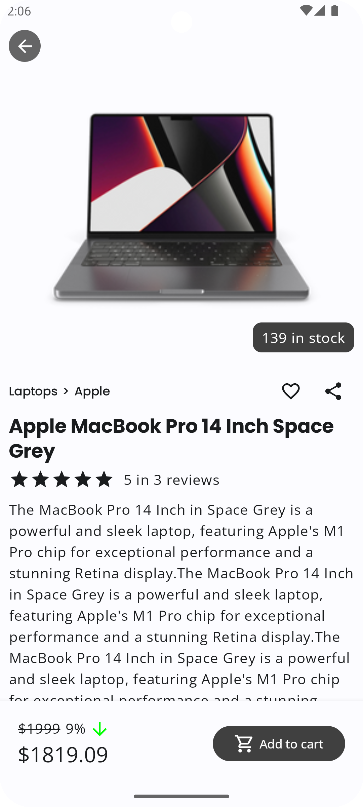
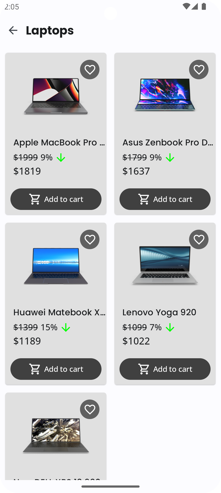
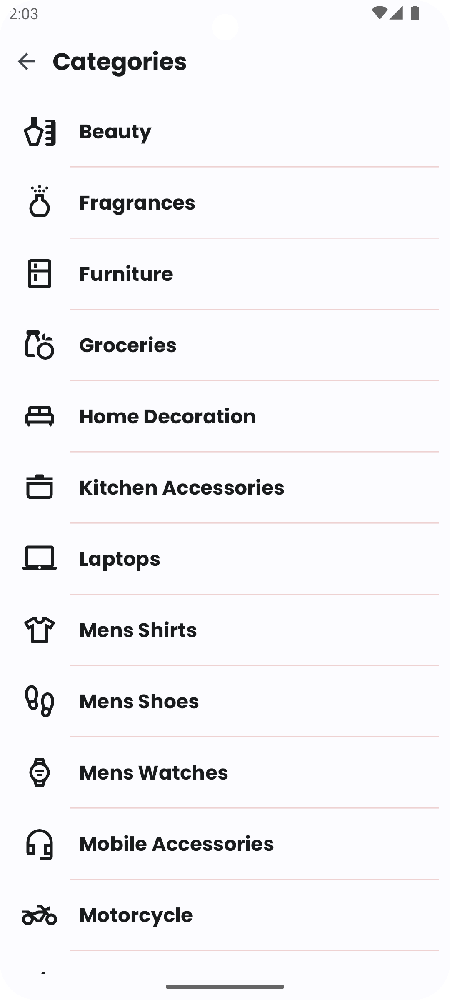
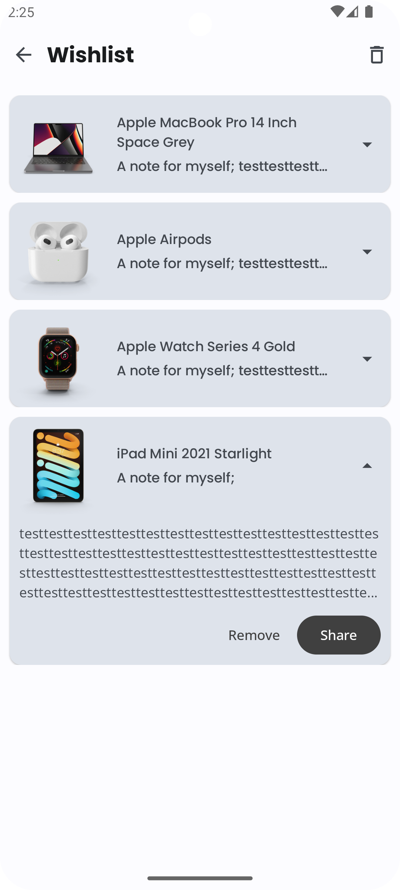
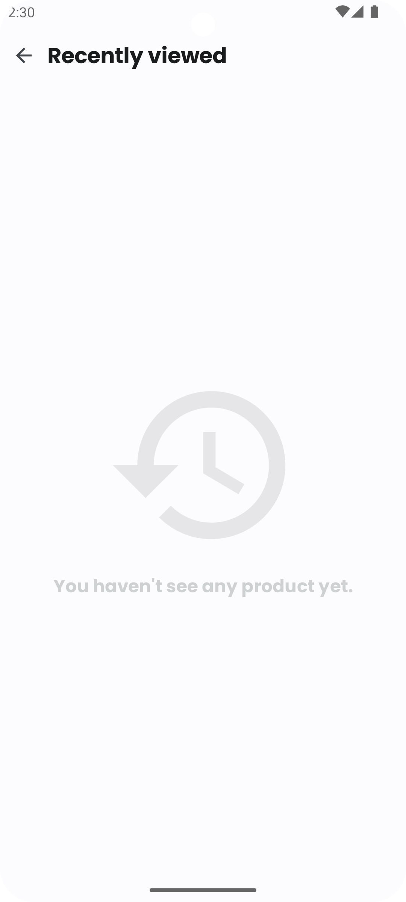
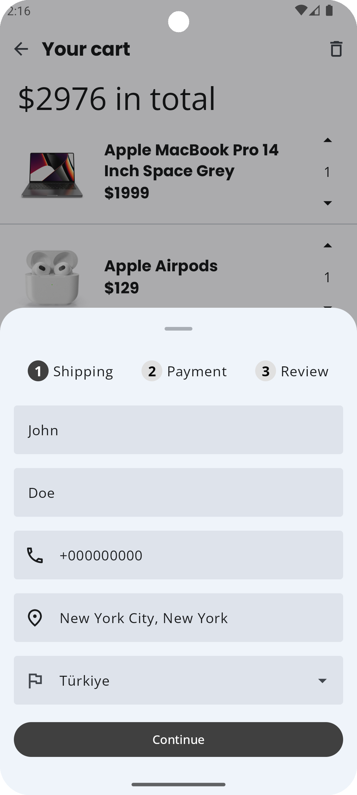
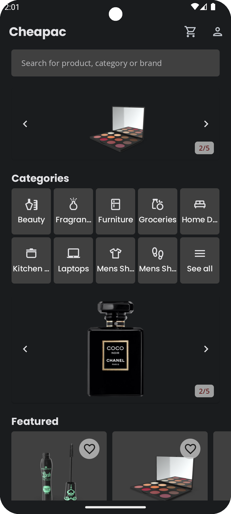
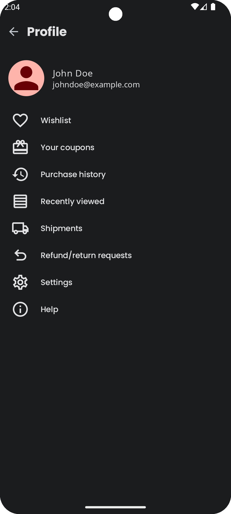
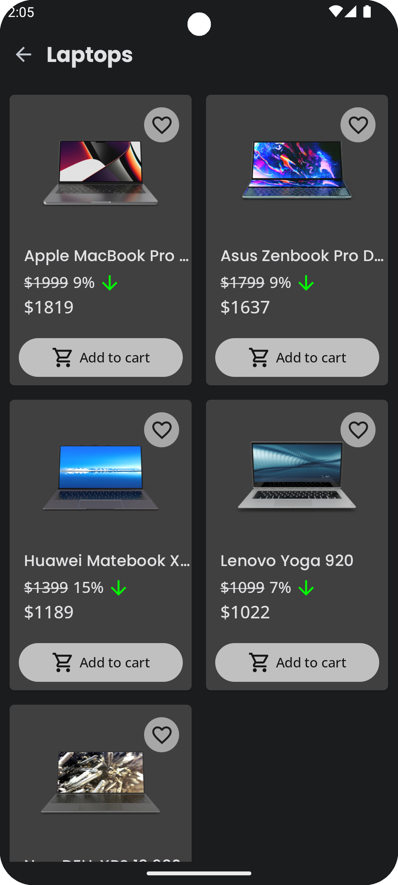
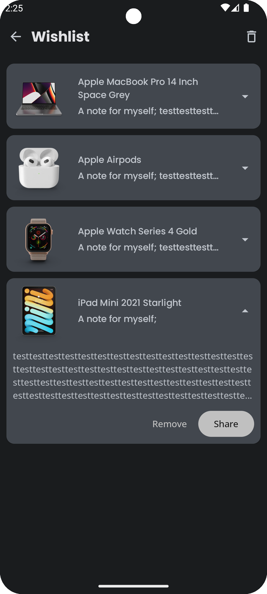

Cheapac
==================

**Cheapac** is an e-commerce Android app build entirely with Kotlin and Jetpack Compose. This repository follows Android design and development best practices and is intended to be a useful reference for developers (especially for beginners).

The app is currently in development. Feel free to contribute to fix bugs or add new cool features.

## Features

**Cheapac** displays content from the
[e-commerce API](https://github.com/Ovi/DummyJSON).
Users can browse the products, add them to their wish list, and leave a note explaining why they want this product. They can share the products they like.

## Screenshots

| :earth_americas:                                                | :rocket:                                                        | :waning_crescent_moon:                                          |
|-----------------------------------------------------------------|-----------------------------------------------------------------|-----------------------------------------------------------------|
|   |   |   |
|   |   |   |
|   |   |   |
|   |  |  |
|  |  |  |
|    |    |    |
|    |    |    |
|    |    |    |
|    |   |   |
|   |   |   |

## Architecture

The **Cheapac** app follows the
[official architecture guidance](https://developer.android.com/topic/architecture) from Android.

## Licence

See the
[license](LICENSE) for more information.
